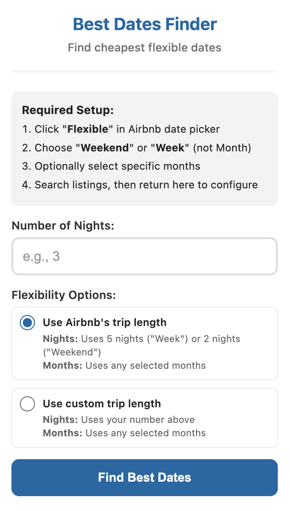

# Airbnb Best Dates Finder

A Chrome extension that automatically finds the cheapest available dates for Airbnb listings, saving you time and money by scanning multiple date combinations across your selected months.

## Overview
This extension solves the tedious process of manually checking each Airbnb listing's calendar to find the best dates. It integrates with Airbnb's **flexible date search**, allowing users to quickly identify the most affordable options across multiple listings.




## Key Features
- **Automatic calendar analysis** - Opens listings in focused background tabs to analyze calendar data
- **Flexible date optimization** - Works with Airbnb's "Weekend" and "Week" filters or custom night counts
- **Queue processing** - Handles multiple listings one at a time with controlled tab management
- **Real-time UI synchronization** - Buttons adapt to filter changes, window resizing, and pagination
- **MutationObserver + debounce** - Efficiently detects Airbnb's React-based DOM changes
- **User feedback** - Buttons update with statuses (`Queued`, `Processing`, `Best Price`, `Error`)
- **Month detection** - Determines target months from Airbnb UI or defaults to next 3 months

### Technical Challenges Solved
1. **Dynamic SPA handling**: Airbnb's React-based site required MutationObserver to detect content updates
2. **Calendar data extraction**: Must focus tabs to trigger Airbnb's lazy-loading calendar content
3. **Sequential processing**: Queue system ensures multiple listings are processed without browser overload
4. **Event handling conflicts**: Prevents Airbnb's navigation events from interfering with extension buttons

## Installation
1. Clone this repository to your local machine.
2. Open Chrome and navigate to `chrome://extensions/`
3. Enable **Developer mode**
4. Click **"Load unpacked"** and select the project folder
5. The extension icon should appear in your Chrome toolbar

## How to Use

### Step 1: Set Up Airbnb Search
1. Go to Airbnb and click **"Flexible"** in the date picker
2. Choose **"Weekend"** or **"Week"** (Monthly stays not supported)
3. Optionally select specific months to search within (if none selected, extension will check the next 3 months)
4. Run your search normally

### Step 2: Configure Extension
1. Click the extension icon to open the popup
2. Enter your desired number of nights (1-7)
3. Choose flexibility option:
   - **Use Airbnb's trip length**: Respects Airbnb's selected duration (Weekend = 2 nights Friday-Sunday, Week = 5 nights Sunday-Friday)
   - **Use custom trip length**: Uses your specified night count with any months selected
4. Click **"Find Best Dates"**

### Step 3: Analyze Listings
- Buttons appear on each listing card after the extension runs:
  - "Check Best Available Dates" (when using Airbnb's trip length)
  - "Check Best N-Night Dates" (when using custom trip length)
- Click buttons for listings you want to analyze - they're added to a processing queue
- Extension processes **one listing at a time**, opening each in a focused background tab to analyze calendar data
- Results display on the button showing the cheapest available dates and total price

## Technical Architecture

### Core Components
- **popup.html/js**: User interface for configuration with input validation
- **content.js**: DOM manipulation, button injection, queue management
- **background.js**: Tab management, calendar navigation, price extraction algorithms
- **helpers/calendarHelpers.js**: Calendar navigation utilities
- **searchModes/**: Search algorithm implementations
  - `findWeekendCombinations.js`: Weekend-specific logic
  - `findWeekCombinations.js`: Week-specific logic
  - `findNNightCombinations.js`: Custom night count logic

### Search Modes

#### Weekend Mode (Airbnb's Weekend Filter)
Finds 2-night Friday-Sunday combinations across selected months, including cross-month weekends that span from the end of one month to the beginning of the next.

#### Week Mode (Airbnb's Week Filter)
Finds 5-night Sunday-Friday combinations across selected months

#### Custom N-Night Mode
Searches for any N-night consecutive available periods within the selected months, ignoring Airbnb's trip length restrictions. Handles same-week, cross-week, and cross-month combinations.

### Key Technical Features

#### Tab Management
- **Sequential processing**: Only one listing analyzed at a time to prevent browser overload
- **Focused tab requirement**: Each listing tab must be focused for Airbnb's dynamic calendar to load properly
- **Automatic cleanup**: Background tabs are closed after analysis completes

#### Calendar Analysis Algorithms
```javascript
// Different search modes based on user selection
if (message.mode === "respect") {
    if (message.tripLength.includes("weekend_trip")) {
        const weekendResults = await findWeekendCombinations(tabId, message.months);
    } else if (message.tripLength.includes("one_week")) {
        const weekResults = await findWeekCombinations(tabId, message.months);
    }
} else if (message.mode === "ignore") {
    const flexibleResults = await findNNightCombinations(tabId, message.months, message.nights);
}
```

#### Dynamic UI Management & Real-time State Synchronization
```javascript
// MutationObserver detects Airbnb's React updates
observer = new MutationObserver((mutations) => {
    // Detects new listings, filter changes, pagination
    if (shouldReprocess && desiredNights > 0) {
        handlePageChange();
    }
});
```

Features include:
- **Filter change detection**: Automatically updates when users modify Airbnb search parameters
- **Button updates**: All listing buttons update immediately when user changes nights or options
- **Window resize handling**: Buttons reappear and adapt to layout changes

## Requirements & Limitations

### Requirements
- Chrome browser
- Airbnb search must use **Flexible dates**
- Trip length must be **Weekend** or **Week** (not Monthly)

### Limitations
- Monthly stays not supported (different pricing structure)
- Fixed date searches not compatible
- Only works with Chrome-based browsers

## Troubleshooting

**Button shows "Error - Try Again"**
- Listing page failed to load properly - click to retry
- Check internet connection

**Buttons not appearing**
- Verify extension is enabled in Chrome
- Ensure you're on an Airbnb search results page with flexible dates selected

## Browser Compatibility
- **Chrome**: Fully supported 
- **Firefox / Safari**: Not supported (Chrome-specific APIs)  

## Technical Skills
- **Chrome Extension APIs**: tabs, storage, messaging, content scripts
- **JavaScript**: async/await, DOM manipulation, event handling, MutationObserver
- **DOM interaction**: Extracting data from React SPA with lazy-loading
- **Queue management**: Sequential tab processing with status updates
- **Browser automation**: Controlled tab focusing and navigation
- **UI/UX Design**: Intuitive popup design with real-time validation

## Privacy & Data Handling
- **Local processing only**: All calendar analysis happens in your browser
- **Temporary data only**: Date and price information is only stored temporarily during analysis
- **Respects rate limits**: Built-in delays between operations to be respectful to Airbnb's servers

## Disclaimer
This extension is not affiliated with, endorsed, or sponsored by Airbnb. It is an independent tool designed to help users find better deals on their bookings.

## Icons
- Calendar icon by [Freepik](https://www.flaticon.com/free-icon-font/calendar_17490077?related_id=17490077) from [Flaticon](https://www.flaticon.com/)