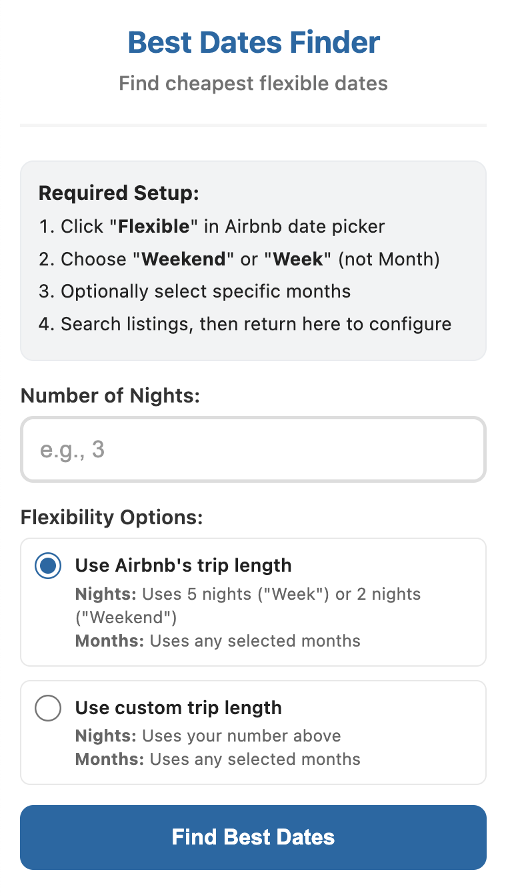
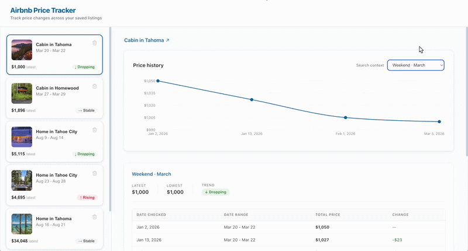

# Airbnb Price Tracker

A **Chrome extension** and **web dashboard** that scans Airbnb listings to find the cheapest available dates and tracks price changes over time.

The extension adds a button to each listing on Airbnb's search results page. When clicked, it opens the listing in a focused tab, scans the calendar across your selected months and trip length, and finds the cheapest available dates.. Results are saved to a PostgreSQL database, where a React dashboard displays price history and trends across every check.


## Extension




## Live Dashboard

**[View the Live Dashboard](https://enthusiastic-contentment-production-66a6.up.railway.app)**



> The live dashboard is read-only. Delete functionality is disabled to preserve demo data and is enabled when running locally.


## Key Features

### Chrome Extension
- **Calendar analysis** — opens listings in focused tabs to scan calendar data
- **Flexible date optimization** — works with Airbnb's "Weekend" and "Week" filters or custom night counts
- **Queue processing** — handles multiple listings one at a time with controlled tab management
- **Real-time UI synchronization** — buttons adapt to filter changes, window resizing, and pagination
- **User feedback** — buttons update with statuses (`Queued`, `Processing`, `Best Price`, `Error`)
- **Month detection** — determines target months from Airbnb UI or defaults to next 3 months

### Dashboard
- **Price history chart** — line chart showing price changes over time per search context
- **Trend indicators** — Rising, Dropping, or Stable based on the last two price checks
- **Search context filtering** — view price history by trip length and month combination

## How to Use

### Step 1: Set Up Airbnb Search
1. Go to Airbnb and click **"Flexible"** in the date picker
2. Choose **"Weekend"** or **"Week"** (Monthly stays not supported)
3. Optionally select specific months (if none selected, the extension checks the next 3 months)
4. Run your search normally

### Step 2: Configure the Extension
1. Click the extension icon to open the popup
2. Enter your desired number of nights (1–7)
3. Choose a flexibility option:
   - **Use Airbnb's trip length** — respects Airbnb's selected duration (Weekend = 2 nights Friday–Sunday, Week = 5 nights Sunday–Friday)
   - **Use custom trip length** — uses your specified night count with any months selected
4. Click **"Find Best Dates"**

### Step 3: Analyze Listings
- Buttons appear on each listing card on the search results page
- Click a button to add that listing to the processing queue
- The extension opens each listing in a background tab, scans the calendar, and shows the cheapest available dates and total price on the button

### Step 4: View the Dashboard
- Open the [live dashboard](https://enthusiastic-contentment-production-66a6.up.railway.app) or `http://localhost:5173` if running locally
- Listings you've checked appear automatically with their price history and trends


## Installation

### Chrome Extension
1. Clone this repository
2. Open Chrome and navigate to `chrome://extensions/`
3. Enable **Developer mode**
4. Click **"Load unpacked"** and select the `extension/` folder
5. The extension icon will appear in your Chrome toolbar

The extension automatically posts data to the deployed backend. No additional setup is required to use the live dashboard.

### Local Development (Full Stack)

**Backend**
```
cd server
npm install
# Create .env with DATABASE_URL=your_postgres_url and PORT=3000
npm run dev
```

**Frontend Dashboard**
```
cd client
npm install
# Vite proxies /api to localhost:3000 automatically
npm run dev
```

**Extension**
1. Open `extension/src/scripts/background.js`
2. Update `API_BASE_URL` to `http://localhost:3000/api`
3. Reload the extension in `chrome://extensions/`

> `VITE_API_URL` is optional locally. The Vite proxy automatically routes `/api` to `localhost:3000`.


## Technical Architecture

### Stack
| Layer | Technology |
|---|---|
| Extension | JavaScript, Chrome Extension APIs |
| Backend API | Node.js, Express, TypeScript |
| Database | PostgreSQL |
| Frontend Dashboard | React, TypeScript, Vite, Recharts |
| Deployment | Railway |

### How It's Built

The extension has three main scripts — `content.js` injects buttons into Airbnb's search results page, `background.js` handles tab management and API posting, and the `searchModes/` folder contains the calendar scanning algorithms for each trip type.

The backend is a small Express API. `listings.ts` handles fetching all listings, saving new price snapshots from the extension, and deleting listings. `snapshots.ts` handles fetching price history for a specific listing. Both the listing upsert and snapshot insert run in a single database transaction to prevent partial writes.

The React dashboard fetches all listings and their price history on load, groups snapshots by search context, and refreshes automatically when you switch back to the tab.


## Technical Challenges

### Extension
- **Dynamic SPA Handling** — Airbnb's search page is React-based, so the DOM changes without a full page reload. MutationObserver watches for these changes and re-injects buttons after navigation or filter updates
- **Calendar Data Extraction** — Airbnb only loads calendar data when a listing tab is focused. The extension manages tab focus to ensure the calendar is loaded before scanning begins
- **Sequential Queue Processing** — when a user queues multiple listings, they're processed one at a time to avoid opening too many tabs and overloading the browser
- **Search Context Race Condition** — the user's selected trip type and months are captured when a listing is queued, not when the API call is made. Without this, changing filters mid-queue would attach the wrong context to a result

### Backend & Database
- **Atomic Writes** — saving a price check involves upserting a listing and inserting a snapshot. These run in a single transaction so a failure midway doesn't leave incomplete data
- **Schema Auto-Initialization** — the server runs `schema.sql` on startup, which meant no manual database setup was needed when deploying to Railway for the first time
- **CORS for Chrome Extensions** — Chrome extensions have dynamic IDs, so the CORS config allows any `chrome-extension://` origin rather than hardcoding a specific ID

### Frontend
- **Search Context Grouping** — price snapshots are grouped by trip type and month combination so each context (e.g. "7 Nights · April") has its own chart and history table rather than mixing all checks together


## Requirements & Limitations
- Chrome browser required
- Airbnb search must use **Flexible dates**
- Trip length must be **Weekend** or **Week** (Monthly not supported)
- Fixed date searches are not compatible

## What I'd improve next

- Store **listing thumbnails locally** instead of relying on Airbnb's image URLs which can break over time
- Add **price drop notifications** when a new manual scan finds a lower price than the previous check for the same search context

## Privacy & Data Handling
- All calendar analysis happens locally in your browser. No Airbnb account data is collected
- Price data (listing URL, name, dates, total price) is stored in PostgreSQL to enable the history feature
- Built-in delays keep requests respectful of Airbnb's servers

## Disclaimer
This extension is not affiliated with, endorsed, or sponsored by Airbnb. It is an independent tool designed to help users find better deals on their bookings.

## Icons
- Calendar icon by [Freepik](https://www.flaticon.com/free-icon-font/calendar_17490077?related_id=17490077) from [Flaticon](https://www.flaticon.com/)